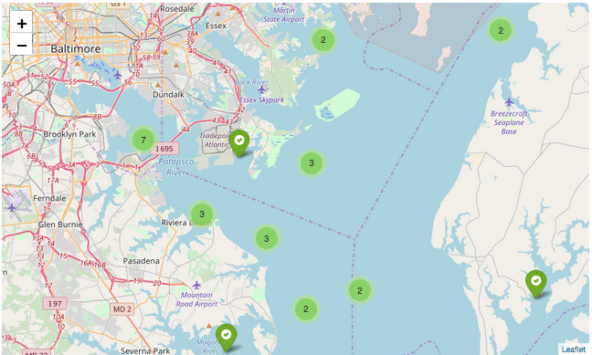

|  | 
|:--:| 

# Mussel Watch ([Kaggle overview](https://www.kaggle.com/sohier/mussel-watch))

### This folder is no longer being updated, please see my notebook on Kaggle ([link](https://www.kaggle.com/pstetz/a-visual-look-at-mussel-watch))

Mussel Watch is a program under NOAA that monitors the marine health.  This notebook explores different substance measurements taken from 1986-2015 in the United State.
